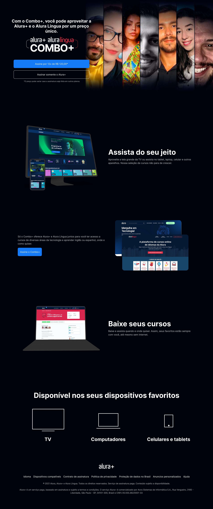

# Alura+

Alura+ projeto da Formação Front-end da Alura. A partir do zero: HTML e CSS para projetos web

## Links:

- https://devmarcosvinicius.github.io/alura-plus-front-end/
- https://alura-plus-delta-blush.vercel.app/

## Alura+ Layout (UI/UX):

## Preview:

## Feito por:

[Marcos Vinicius](https://www.marcosviniciusdev.com)